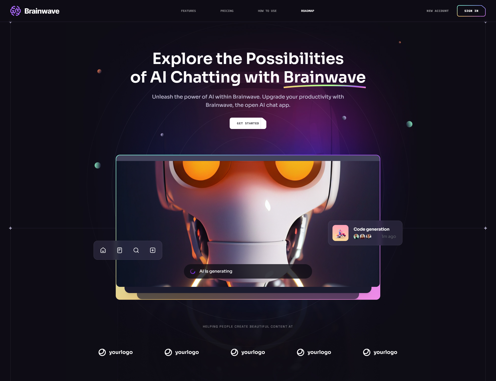

# Brainwave



Brainwave is a modern UI/UX website developed using React and Tailwind CSS, exemplifying modern UI/UX principles. Its sleek design, seamless animations, and overall user experience set a high standard, serving as a reference or inspiration for future modern applications or websites in general.

## Tech Stack
- Vite
- React
- Tailwind CSS

## Features
- **Beautiful Sections:** Includes hero, services, features, how to use, roadmap, pricing, footer, and header.
- **Parallax Animations:** Engaging effects triggered by mouse movement and scrolling
- **Complex UI Geometry:** Utilizes tailwindcss for intricate shapes like circular feature displays, grid lines, and side lines.
- **Latest UI Trends:** Incorporates modern design elements such as bento grids.
- **Cool Gradients:** Enhances visuals with stylish gradients using Tailwind CSS for cards, buttons, etc.
- **Responsive:** Ensures seamless functionality and aesthetics across all devices
- *and many more, including code architecture and reusability*

## Quick Start
Follow these steps to set up the project locally on your machine.

### Cloning the Repository
```bash
git clone https://github.com/Rekl0w/Brainwave.git
cd Brainwave
```

### Installation
Install the project dependencies using npm:
```bash
npm install
```

### Running the Project
```bash
npm run dev
```

Open http://localhost:5173 in your browser to view the project.

**Deployed Version:** [Go To Page](https://brainwave-dusky.vercel.app/)

## License

This project is licensed under the MIT License. See the [LICENSE](LICENSE) file for more information.